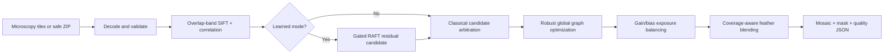

<div align="center">


# StitchNet Laboratory

### Confidence-aware microscopy image stitching for digital pathology and cell-imaging research

Turn overlapping microscope fields into one seamless, globally consistent, quality-scored mosaic—with classical computer vision, optional gated RAFT refinement, and a private local workflow.

<p>
  <a href="https://muhammadmahadazher.github.io/optical-image-aberration-Removel_using_StitchNet/"></a>
  <a href="#-quick-start"></a>
  <a href="docs/EVALUATION.md"></a>
</p>

[](https://github.com/muhammadmahadazher/optical-image-aberration-Removel_using_StitchNet/actions/workflows/ci.yml)
[](https://github.com/muhammadmahadazher/optical-image-aberration-Removel_using_StitchNet/actions/workflows/pages.yml)


</div>

> [!IMPORTANT]
> StitchNet Laboratory is research software for microscopy preprocessing. It is **not a medical device**, does **not detect or diagnose cancer**, and has not been clinically validated. Reconstruction confidence is engineering evidence—not clinical confidence.

## What is StitchNet Laboratory?

StitchNet Laboratory is an open microscopy mosaic reconstruction workspace. It registers overlapping PNG, TIFF, JPEG, or BMP fields; solves all tile positions as one robust graph; corrects exposure differences; blends seams; and releases the output with a machine-readable quality report.

It was rebuilt from the original StitchNet prototype to solve the practical failure modes that matter in microscopy: accumulated drift, black holes, duplicated tissue, low-texture tiles, inconsistent illumination, unsafe learned corrections, excessive memory allocation, malformed uploads, and results without provenance.

<table>
<tr>
<td width="33%" valign="top"><h3>🧭 Globally consistent</h3><p>Pairwise SIFT and correlation evidence is optimized as one robust stage graph, reducing row-by-row drift.</p></td>
<td width="33%" valign="top"><h3>🛡️ Gated learning</h3><p>Fine-tuned RAFT proposals are accepted only when they improve overlap photometry. Failed checkpoints are refused.</p></td>
<td width="33%" valign="top"><h3>🔬 Evidence first</h3><p>Every mosaic includes coverage, placement residuals, seam disagreement, fallbacks, warnings, and provenance.</p></td>
</tr>
</table>

## ✨ Try it before installing

### [Open the hosted StitchNet demo →](https://muhammadmahadazher.github.io/optical-image-aberration-Removel_using_StitchNet/)

The GitHub Pages demo is a read-only interactive preview containing a verified public H&E test fixture, full-quality mosaic download, and JSON report. It does not upload images or claim to run the Python/CUDA backend in a static browser host.

| Experience | Hosted demo | Local workspace |
|---|---:|---:|
| Explore the complete liquid-glass interface | ✅ | ✅ |
| Inspect/download a verified H&E result | ✅ | ✅ |
| Process private microscopy tiles | — | ✅ |
| Classical SIFT/correlation registration | — | ✅ |
| RTX/CUDA learned refinement | — | ✅ |
| 8-bit and 16-bit full-resolution output | Sample | ✅ |

## Why do microscopy mosaics fail?

Naive stitching treats every neighbor match independently. Small errors accumulate across rows and columns, intensity changes produce visible blocks, featureless overlaps generate unstable transforms, and intensity-based cropping can delete legitimate black pixels. StitchNet addresses these issues as one constrained reconstruction problem.



## Core capabilities

- **Robust registration:** overlap-constrained SIFT, normalized correlation, nominal priors, confidence scoring, and deterministic fallback.
- **Global optimization:** robust least-squares tile placement with anchor constraints and inconsistent-edge rejection.
- **Safe learned refinement:** quality-gated torchvision RAFT-small checkpoint trained within an RTX 4060 8 GB budget.
- **Microscopy-aware blending:** graph-solved gain/bias correction, feather or mean blending, and coverage-mask cropping.
- **Real image support:** grayscale, RGB, RGBA, mixed dimensions, underfilled 16-bit TIFF, 8/16-bit output, single rows, single columns, and incomplete grids.
- **Local job backend:** FastAPI jobs, progress polling, restart recovery, previews, masks, full mosaics, and JSON artifacts.
- **Archive security:** traversal, absolute-path, symlink, encrypted-entry, file-count, expanded-size, and compression-ratio defenses.
- **Cross-platform UX:** one launcher for Windows, Linux, and macOS, including reliable frontend caching in synced folders.
- **Reproducible engineering:** deterministic training/evaluation, 25 automated tests, stress scenarios, and GitHub Actions CI.

## 🚀 Quick start

### Requirements

- Python 3.10–3.12
- Node.js 20.19+ (Node 22 recommended)
- Git
- Optional: NVIDIA CUDA GPU; the validated learned checkpoint was trained and tested on an RTX 4060 Laptop GPU with 8 GB VRAM

### Install

```bash
git clone https://github.com/muhammadmahadazher/optical-image-aberration-Removel_using_StitchNet.git
cd optical-image-aberration-Removel_using_StitchNet
python -m pip install -e ".[ml,dev]"
```

### Run everything

```bash
python start.py
```

The launcher opens the UI at `http://127.0.0.1:3000` and starts the API at `http://127.0.0.1:8000`.

```bash
# Useful alternatives
python start.py --no-browser
python start.py --backend-only
python start.py --frontend-only
```

<details>
<summary><strong>Windows PowerShell notes</strong></summary>

Use the same commands in PowerShell. If your execution policy blocks environment activation, direct `python -m pip` and `python start.py` commands still work without activating a virtual environment.

</details>

## Prepare tile names

Explicit row and column coordinates are the most reliable input convention:

```text
specimen_r001_c001.tif
specimen_r001_c002.tif
specimen_r002_c001.tif
specimen_r002_c002.tif
```

Indexed names such as `specimen_0001.png` are also supported when grid columns are provided. You can upload individual files or one safe ZIP archive.

## Command-line usage

```bash
# Recommended classical/hybrid mode
stitchnet data/my_tiles --overlap 0.20 --output mosaic.png

# Add the no-regression learned candidate
stitchnet data/my_tiles --overlap 0.20 --registration learned --output mosaic.png

# Preserve microscopy dynamic range
stitchnet data/my_tiles --overlap 0.20 --bit-depth 16 --output mosaic.tif
```

Every run writes a quality report next to the mosaic.

## Benchmark evidence

All reported values were produced locally on 18 July 2026. Full conditions, hashes, limitations, and pair constraints are available in [the evaluation report](docs/EVALUATION.md).

| Evaluation | Result |
|---|---:|
| Official NIST MIST 25-tile phase mosaic | **0.584 px** placement p95 · **1.000** coverage · **0** fallbacks |
| Perturbed held-out H&E · hybrid | **0.199 px** ground-truth placement p95 |
| Perturbed held-out H&E · learned + gated | **0.156 px** ground-truth placement p95 |
| Held-out H&E synthetic-warp error reduction | **20.18%** |
| Deterministic stress suite | **4/4 passed** |
| Python core, API, security, and ML tests | **25/25 passed** |

The learned H&E evaluation source was never used for optimization. The runtime loader rejects checkpoints without `quality_gate_passed: true` metadata, and every learned correspondence is independently photometrically gated.

## Train or reproduce the model

```bash
python -m training.train_raft_refiner \
  --train-dir data/external/nist_mist/tiles/Small_Phase_Test_Dataset/image-tiles \
  --open-world-image data/external/openslide/CMU-1-Small-Region.svs
```

Training uses deterministic source-level splits, synthetic smooth optical distortions, frozen RAFT encoders, a small trainable update block, automatic mixed precision, and deployment gates. See [data provenance](data/README.md) before downloading or redistributing fixtures.

## Test the complete system

```bash
python -m pytest -q
python -m ruff check src backend tests training evaluation scripts start.py
python scripts/frontend.py test
python -m evaluation.stress_suite
python -m evaluation.open_world_mosaic \
  --source data/external/openslide/CMU-1-Small-Region.svs
```

## Repository architecture

```text
backend/             FastAPI service, secure uploads, persistent job worker
frontend/            React + Vite liquid-glass interface and Pages preview
src/stitchnet/       Registration, graph optimizer, blending, I/O, CLI, ML gates
training/            RTX-friendly deterministic training and evaluation
evaluation/          Open-world and stress benchmarks
tests/               Unit, integration, archive-security, API, and ML tests
models/              Quality-gated RAFT-small checkpoint
reports/             Machine-readable benchmark and training evidence
legacy/              Original prototype retained for code audit only
docs/                Architecture, deployment, evaluation, and medical safety
```

Read the design decisions in [ARCHITECTURE.md](docs/ARCHITECTURE.md), the hosted-demo contract in [DEPLOYMENT.md](docs/DEPLOYMENT.md), and the clinical boundary in [MEDICAL_SAFETY.md](docs/MEDICAL_SAFETY.md).

## Frequently asked questions

### Does StitchNet detect cancer cells?

No. StitchNet reconstructs microscopy mosaics for downstream research. It has no cancer labels, diagnostic classifier, sensitivity/specificity claim, or clinical authorization.

### Does the learned model replace classical registration?

No. Learned flow is an optional residual proposal. Every proposal must improve overlap photometry, and classical feature/correlation candidates remain available as fallbacks.

### Do uploaded images leave my computer?

Not in the local application. The backend binds to localhost by default and stores jobs locally. Researchers remain responsible for authorization, de-identification, retention, access control, and institutional requirements.

### Can it stitch 16-bit microscopy TIFF files?

Yes. StitchNet handles grayscale and color high-bit-depth inputs, consistent normalization, 16-bit output, and intensity-independent coverage cropping.

### Why is the hosted demo read-only?

GitHub Pages is a static host and cannot run the Python/OpenCV/PyTorch backend or reserve an RTX GPU. The public preview therefore uses a verified, provenance-linked result instead of sending visitor images to an undisclosed service.

## Responsible research use

- Review the mosaic, coverage mask, warnings, fallbacks, and full-resolution overlaps before analysis.
- Never interpret registration confidence as biological certainty or diagnostic confidence.
- Validate performance for every scanner, objective, stain, preparation protocol, and acquisition pattern.
- Do not process patient-associated data without the required governance and security controls.
- Report safety or privacy concerns privately using the repository's security contact process.

## Citation

If StitchNet supports your research, cite the software using [`CITATION.cff`](CITATION.cff). Dataset citations and hashes are documented separately in [`data/README.md`](data/README.md).

## Contributing

Issues and focused pull requests are welcome. Please include a reproducible tile fixture or synthetic generator, expected geometry, quality-report changes, and relevant tests. Clinical claims or patient data must not be included in issues.

## License

The software is available under the [MIT License](LICENSE). Public microscopy fixtures and third-party dependencies retain their own terms; review [data provenance](data/README.md) before redistribution.

---

<div align="center">

**Microscopy stitching · digital pathology · medical imaging · image mosaicing · computer vision · OpenCV · PyTorch · RAFT optical flow · FastAPI · React**

Built for careful reconstruction, transparent evidence, and expert review.

</div>
