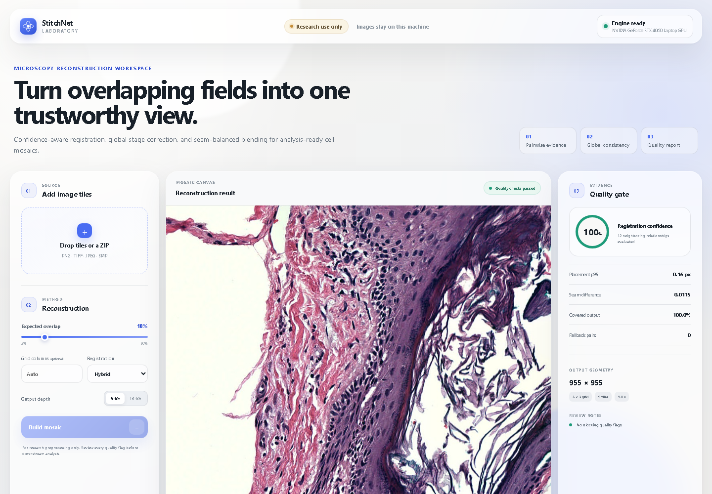
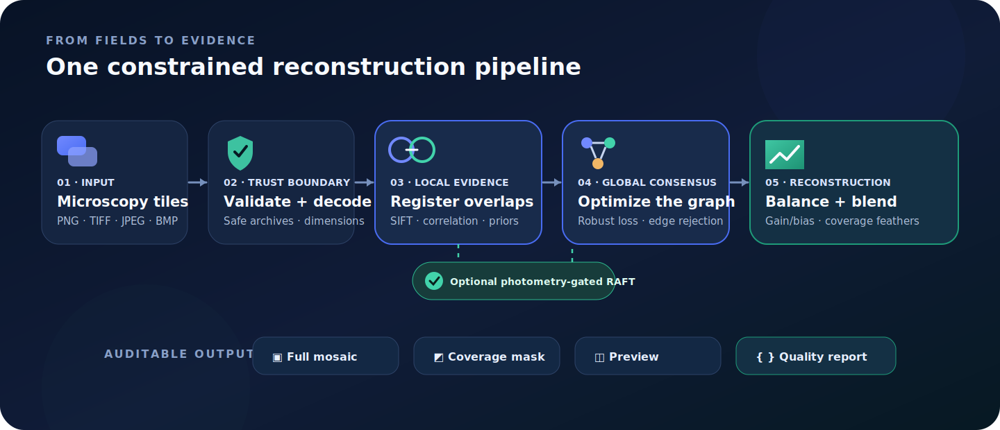
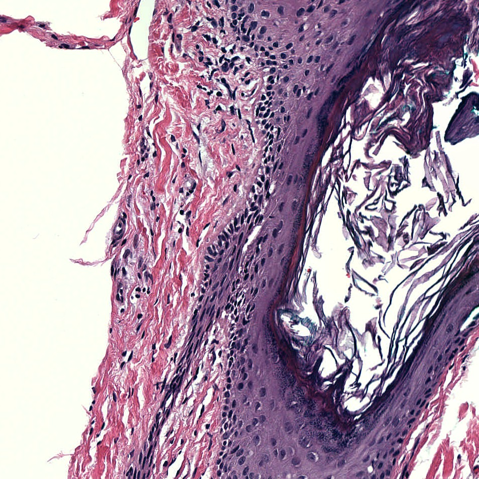
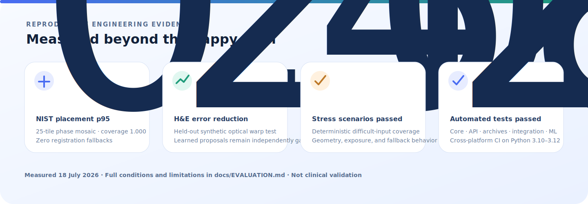

# StitchNet Laboratory

### Reliable microscopy mosaic reconstruction—with confidence you can inspect

Turn overlapping microscope fields into one seamless, globally optimized mosaic using OpenCV registration, optional quality-gated RAFT refinement, and an auditable JSON report.

  
  
  

> [!IMPORTANT]
> StitchNet Laboratory is microscopy preprocessing research software. It is **not a medical device**, does **not detect or diagnose cancer**, and has not been clinically validated. Reconstruction confidence is engineering evidence—not clinical confidence.

## At a glance

<table>
<tr>
<td width="33%" valign="top"><h3>🧭 One global solution</h3>
Pairwise SIFT and correlation evidence is solved as a robust stage graph, preventing row-by-row drift.
</td>
<td width="33%" valign="top"><h3>🛡️ Learning with guardrails</h3>
RAFT residual proposals are accepted only when they improve overlap photometry. Unsafe checkpoints are refused.
</td>
<td width="33%" valign="top"><h3>🔬 Evidence with every run</h3>
Coverage, residuals, seam disagreement, fallbacks, warnings, and provenance ship beside the mosaic.
</td>
</tr>
</table>

## ✨ See it work

The [hosted demo](https://muhammadmahadazher.github.io/optical-image-aberration-Removel_using_StitchNet/) is a zero-install, read-only tour with a verified public H&E fixture, downloadable mosaic, coverage mask, and complete quality report.

<table>
<tr>
<td width="60%"></td>
<td width="40%"></td>
</tr>
<tr>
<td align="center"><strong>Liquid-glass local workspace</strong></td>
<td align="center"><strong>Verified H&amp;E reconstruction</strong></td>
</tr>
</table>

The static demo does not upload visitor data or pretend to run Python/CUDA in GitHub Pages. Install locally to process your own microscopy tiles.

| Capability | Hosted demo | Local app |
|---|:---:|:---:|
| Explore the complete interface | ✅ | ✅ |
| Inspect and download a verified result | ✅ | ✅ |
| Process private PNG/TIFF/JPEG/BMP tiles | — | ✅ |
| Run classical global registration | — | ✅ |
| Run RTX/CUDA learned refinement | — | ✅ |
| Export 8-bit or 16-bit full resolution | Sample | ✅ |

## Why does it stitch more reliably?

Naive mosaicing chains neighbor transforms. Tiny errors then accumulate, illumination changes become visible blocks, and low-texture overlaps can create duplicated tissue or black holes. StitchNet treats reconstruction as one constrained graph:

1. **Validate** every file, channel layout, dimension, and archive member.
2. **Measure** overlap bands with SIFT, normalized correlation, and nominal priors.
3. **Arbitrate** candidates by confidence; optionally test a gated RAFT residual.
4. **Optimize** every tile position together with robust least squares.
5. **Balance and blend** exposure using gain/bias correction and coverage-aware feathers.
6. **Release evidence** as the mosaic, mask, preview, and machine-readable report.

This design handles grayscale, RGB, RGBA, mixed dimensions, 16-bit TIFF, single-row or single-column scans, and incomplete grids.

## 📊 Verified evidence

| Evaluation | Reproduced result |
|---|---:|
| NIST MIST 25-tile phase mosaic | **0.584 px** placement p95 · **1.000** coverage · **0** fallbacks |
| Perturbed held-out H&E · hybrid | **0.199 px** ground-truth placement p95 |
| Perturbed held-out H&E · learned + gated | **0.156 px** ground-truth placement p95 |
| Held-out H&E synthetic-warp evaluation | **20.18%** error reduction |
| Deterministic stress suite | **4/4 passed** |
| Current automated test suite | **26/26 passed** |

Results were produced locally on **18 July 2026**. See [evaluation conditions, source hashes, constraints, and limitations](docs/EVALUATION.md). The held-out H&E source was not used for optimization; these engineering benchmarks are not clinical validation.

## 🚀 Quick start

### Prerequisites

- Python **3.10–3.12**
- Node.js **20.19+**; Node 22 is recommended
- Git
- Optional NVIDIA CUDA GPU; learned mode was validated on an RTX 4060 Laptop GPU with 8 GB VRAM

### Install and launch

~~~bash
git clone https://github.com/muhammadmahadazher/optical-image-aberration-Removel_using_StitchNet.git
cd optical-image-aberration-Removel_using_StitchNet
python -m pip install -e ".[ml]"
python start.py
~~~

That one launch command starts the FastAPI backend, prepares the React frontend, and opens http://127.0.0.1:3000.

<strong>CPU-only, developer, and launcher options</strong>

~~~bash
# Classical stitching without the optional PyTorch runtime
python -m pip install -e .

# Development and test tools
python -m pip install -e ".[ml,dev]"

# Launcher options
python start.py --no-browser
python start.py --backend-only
python start.py --frontend-only
~~~

The same commands work on Windows PowerShell, Linux, and macOS. A virtual environment is recommended but not required.

### Stitch in three steps

1. Drop individual tiles or one safe ZIP into the workspace.
2. Confirm overlap, columns, registration mode, blending, and output depth.
3. Run the job, inspect warnings and coverage, then download the mosaic and report.

For the most reliable layout inference, name tiles with explicit coordinates:

~~~text
specimen_r001_c001.tif    specimen_r001_c002.tif
specimen_r002_c001.tif    specimen_r002_c002.tif
~~~

Indexed names such as specimen_0001.png also work when you provide the column count.

## Command line

~~~bash
# Recommended global classical/hybrid mode
stitchnet data/my_tiles --overlap 0.20 --output mosaic.png

# Add the no-regression learned candidate
stitchnet data/my_tiles --overlap 0.20 --registration learned --output mosaic.png

# Preserve microscopy dynamic range
stitchnet data/my_tiles --overlap 0.20 --bit-depth 16 --output mosaic.tif
~~~

Every command writes its quality report beside the mosaic.

## What is inside?

~~~text
backend/          FastAPI jobs, safe uploads, recovery, artifact delivery
frontend/         React + Vite liquid-glass workspace and Pages demo
src/stitchnet/    Registration, global graph solver, blending, I/O, CLI
training/         RTX-friendly deterministic RAFT refinement training
evaluation/       Open-world, synthetic, and stress benchmarks
tests/            Unit, API, archive-security, integration, and ML gates
models/           Quality-gated learned checkpoint
reports/          Machine-readable benchmark and training evidence
legacy/           Original source prototype retained for code audit
~~~

| Read next | Purpose |
|---|---|
| [Architecture](docs/ARCHITECTURE.md) | Components, algorithms, data flow, and engineering decisions |
| [Evaluation](docs/EVALUATION.md) | Benchmarks, fixtures, hashes, limitations, and reproduction |
| [Deployment](docs/DEPLOYMENT.md) | Local backend and honest static-demo hosting contract |
| [Medical safety](docs/MEDICAL_SAFETY.md) | Intended use, exclusions, review, and governance boundaries |
| [Data provenance](data/README.md) | Dataset sources, terms, checksums, and redistribution notes |

<strong>Test, stress, and train the system</strong>

~~~bash
# Maintained application surfaces
python -m pytest -q
python -m ruff check src backend tests training evaluation scripts start.py
python scripts/frontend.py test

# Deterministic stress and open-world evaluation
python -m evaluation.stress_suite
python -m evaluation.open_world_mosaic \
  --source data/external/openslide/CMU-1-Small-Region.svs

# Reproduce RTX-friendly training
python -m training.train_raft_refiner \
  --train-dir data/external/nist_mist/tiles/Small_Phase_Test_Dataset/image-tiles \
  --open-world-image data/external/openslide/CMU-1-Small-Region.svs
~~~

Training uses deterministic source-level splits, smooth synthetic optical distortions, frozen RAFT encoders, a small trainable update block, mixed precision, and deployment quality gates.

## Frequently asked questions

<strong>Does StitchNet detect cancer cells?</strong>

No. StitchNet reconstructs microscopy mosaics for downstream research. It contains no cancer classifier, diagnostic threshold, sensitivity/specificity claim, or clinical authorization.

<strong>Does the learned model replace classical registration?</strong>

No. Learned flow is an optional residual proposal. It must improve overlap photometry; classical feature and correlation candidates remain available as fallbacks.

<strong>Do uploaded images leave my computer?</strong>

Not in the local application. The backend binds to localhost and stores jobs locally. Researchers still remain responsible for authorization, de-identification, retention, access control, and institutional policy.

<strong>Can StitchNet preserve 16-bit microscopy TIFF data?</strong>

Yes. It supports grayscale and color high-bit-depth input, consistent normalization, 16-bit export, and intensity-independent coverage cropping.

## Responsible research use

Review the full-resolution overlaps, mosaic, coverage mask, warnings, and fallbacks before downstream analysis. Validate performance for every scanner, objective, stain, preparation protocol, and acquisition pattern. Never interpret registration confidence as biological certainty.

## Citation, contribution, and license

If StitchNet supports your research, cite the software using [CITATION.cff](CITATION.cff). Reproducible issues and focused pull requests are welcome; never include patient data or unsupported clinical claims.

Released under the [MIT License](LICENSE). Public fixtures and third-party dependencies keep their own terms—review [data provenance](data/README.md) before redistribution.

---

**Microscopy stitching · digital pathology · medical imaging · image mosaicing · computer vision · OpenCV · PyTorch · RAFT optical flow · FastAPI · React**

Built for careful reconstruction, transparent evidence, and expert review.

